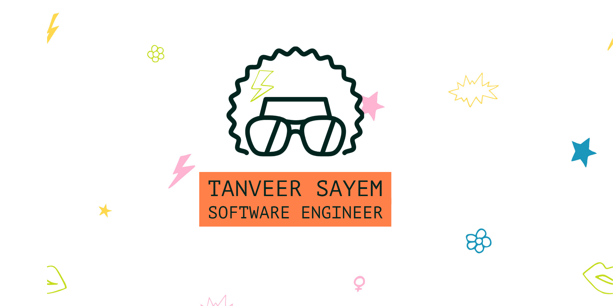

<> 

# Hello, folks! 
I'm a developer that loves simplifying things. I love breaking down complex problems into simple, easy to understand solutions. I Currently live in Indiana, USA as a software Engineer. In my spare time, I create YT videos on software development and mentor new developers.

  

 

